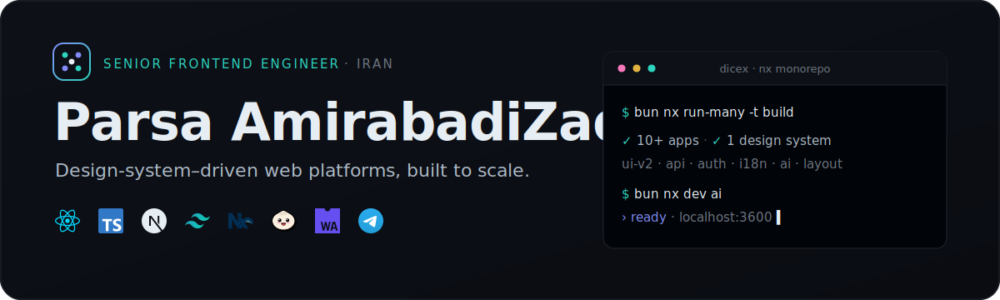
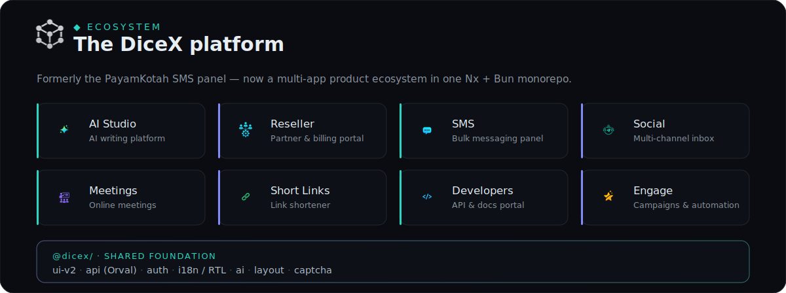
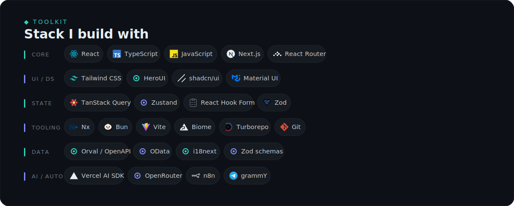

<!-- Profile README — lives in the repo github.com/Parsa5436/Parsa5436 -->

  

Senior frontend engineer based in **Oman**. I turn sprawling product requirements into calm, design-system–driven interfaces — and I like the hard parts: **monorepo architecture**, **i18n / RTL at scale**, **streaming AI UX**, and shaving milliseconds off the render path.

 

## ◆ What I build

  

Most of my day goes into **DiceX** — the product formerly known as the *PayamKotah* SMS panel, now a multi-app ecosystem: **~10 apps and one shared design system** in a single **Nx&nbsp;+&nbsp;Bun** monorepo. I own the frontend platform end to end — the shared `@dicex/ui` component library, auto-generated **Orval** API hooks over OData/REST, auth, i18n/RTL, and an in-house **AI writing assistant** wired into every message composer across the suite.

 

## ◆ Stack

  

 

## ◆ Selected work

- **DiceX platform** — Multi-app frontend ecosystem — React Router v7 · HeroUI · TanStack Query · RHF + Zod · Nx. A shared design system, KYC onboarding, reseller portal, dashboards and statistical reports with date-range analytics.
- **DiceX AI Studio** — In-product AI writing platform on **Vercel AI SDK v7** + OpenRouter: token streaming, structured (Zod) output, Persian-aware SMS tooling, and server-side usage metering.
- **Pixel** — Client-side image optimizer & icon studio — **WASM** codecs (jSquash), Comlink workers, SVGO, and raster→SVG vectorization exported as **Iconify** packs.
- **Seamless — landing** — Motion-heavy marketing site — Next.js · **GSAP** · Lenis · **react-three-fiber** WebGL hero · RTL · surgical, choreographed motion.
- **Telegram bots** — Reseller and media-download bots built with **grammY** + Telegram Bot API, orchestrated with **n8n** automation flows.

 

## ◆ By the numbers

  
  

 

## ◆ Reach me

  
  
  

<code>◆</code> Building with React, one design system at a time.

